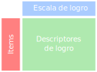
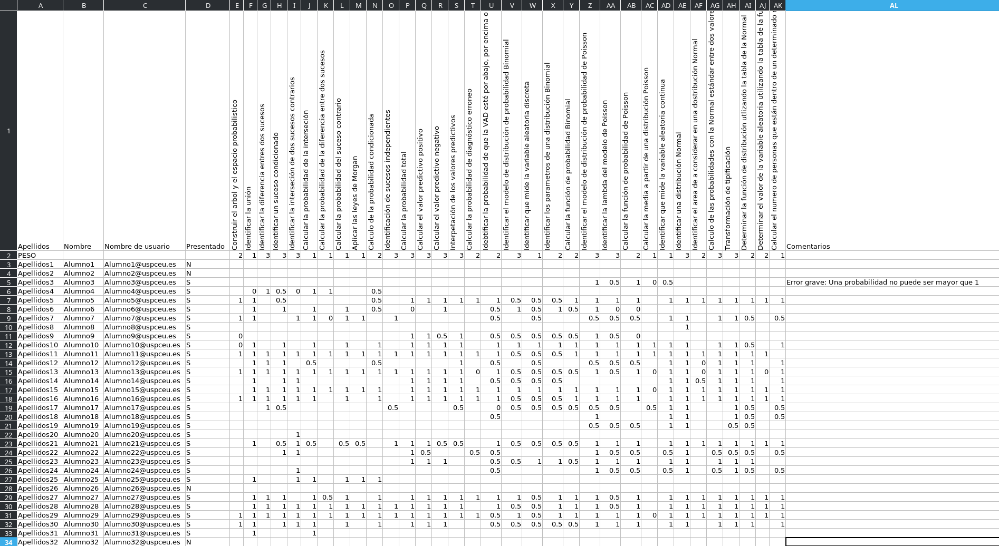

<!-- .slide: data-background="img/cied.jpg" -->

    

**II Congreso CEU de Innovación Educativa y Docente** 

Evaluación con Rúbricas  
en Matemáticas y Estadística

Gloria Anemone <a href="mailto:gloria.anemone@ceu.es"> <i class='fa fa-envelope'></i></a>  
Alfredo Sánchez Alberca <a href="mailto:asalber@ceu.es"><i class='fa fa-envelope'></i></a> <a href="https://twitter.com/aprendeconalf"><i class='fa fa-twitter'></i></a> <a href="https://aprendeconalf.es"><i class='fa fa-home'></i></a>

6 julio 2021

---

<!-- .slide: data-background="img/students-doing-exam.jpg" -->

# ¿POR QUÉ?

--

## Espacio Europeo de Educación Superior

- Aprendizaje basado en competencias.
- Introducción de los **resultados de aprendizaje**.
- Necesidad de nuevos sistemas de evaluación de los resultados de aprendizaje.[1]

--

## Problemas de la evaluación tradicional en Matemáticas

- Basada en exámenes de desarrollo.
- El peso de los ejercicios es arbitrario.
- Un mismo aspecto o item se puntúa repetidas veces.
- Dificultad para consensuar criterios de corrección.
- Bastante subjetividad.
- El alumno no sabe bien de qué y cómo se le va a evaluar.
- Sin retroalimentación para el alumno (salvo si hace la revisión del examen.)

note:
-Son más difíciles de evaluar que los exámenes tipo test.  
-Se otorga un peso a cada ejercicio que no siempre se corresponde con la importancia de los aspectos evaluados en el ejercicio.  
-En asignaturas de varios profesores es necesario consensuar los criterios de calificación para cada examen.  
-A pesar de que se usen unos criterios de corrección compartidos, en algunos aspectos queda bastante margen para la subjetividad.  
-El alumno no sabe a priori cómo se le va a evaluar y ello suele provocar incertidumbre y ansiedad.  
-El resultado de la evaluación suele ser una nota pero no es habitual pasarle al estudiante la corrección para que tome conciencia de sus fallos.

---

<!-- .slide: data-background="img/nivel-logro.jpg" -->

# RÚBRICAS

--

## ¿Qué es una rúbrica?

Es un instrumento de evaluación basado en un una tabla de doble entrada con los siguientes elementos:
 
- Items: Aspectos a evaluar.
- Escala de logros: Niveles de desempeño.
- Descriptores de logro: Descripción del desempeño asociado a cada nivel de la escala de logros.

--

## Rúbricas para evaluar las Matemáticas

Sorprendentemente, el uso de rúbricas en la evaluación de materias científico-técnicas y en particular en materias de Matemáticas y Estadística has sido bastante reducido. [8, 9, 10]

--

## Diseño de la rúbrica

**Items**

- Generados a partir de los resultados de aprendizaje.
- Atómicos 
- Exhaustivos 
- Objetivos 
- Medibles
- Con peso

**Escala de logro**<!-- .element: class="fragment" data-fragment-index="1" -->

Tres niveles:<!-- .element: class="fragment" data-fragment-index="1" -->

- 😞 No conseguido  
- 😐 Parcialmente conseguido
- 😊 Conseguido <!-- .element: class="fragment" data-fragment-index="1" -->

 

--

## Rúbrica de Estadística Aplicada a las Ciencias de la Salud de 2º de Fisioterapia

<iframe data-src="https://aprendeconalf.es/rubricas/rubrica-estadistica.html" width="945" height="555" frameborder="0" marginwidth="0" marginheight="0" scrolling="yes" style="border:3px solid #666; margin-bottom:5px; max-width: 600%;" allowfullscreen=""></iframe>

--

## Corrección

---

## Ventajas de la evaluación por rúbricas

- Pone el foco en la consecución de los resultados de aprendizaje.
- Reduce la subjetividad en la evaluación.
- Mayor transparencia para el alumno.
- Identifica los logros y las **dificultades**.
- Retroalimenta el proceso de aprendizaje.  
[4, 5, 6, 7, 9]

note:
-Los items que se evalúan provienen de la descomposición de los resultados de aprendizaje.  
-Al ser items atómicos es más objetivo evaluar cada item. Permite una evaluación más justa en asignaturas impartidas por varios profesores.  
-El alumno sabe a priori qué se espera de su trabajo.  
-Permite tanto al profesor como al alumno identificar los items o aspectos que hay que reforzar.  
-Proporciona una valiosa información para el profesor y el alumno de cara a orientar el proceso de aprendizaje.  

--

## Inconvenientes de la evaluación por rúbricas

- Requiere consensuar los pesos de los items.
- Cada examen requiere requiere su propia rúbrica. 

---

<!-- .slide: data-background="img/aplicacion-evaluacion-rubricas.png" -->

# APLICACIÓN

---

# Referencias

1. Garcia‐Sanz, M.P. (2014). La evaluación de competencias en Educación Superior mediante rúbricas: un caso práctico. Revista Electrónica Interuniversitaria de Formación del Profesorado, 17 (1), 87‐106. DOI: http://dx.doi.org/10.6018/reifop.17.1. 198861.

2. Sánchez-Santamaría, J., & Cervantes, B. I. B. (2018). Función Pedagógica de las Rúbricas para la Evaluación Formativa y Compartida de los Aprendizajes Universitarios. In Conference Proceedings EDUNOVATIC 2017: 2nd Virtual International Conference on Education, Innovation and ICT (p. 419). Adaya Press. 

3. Stevens, D. D., & Levi, A. J. (2013). Introduction to rubrics: An assessment tool to save grading time, convey effective feedback, and promote student learning. Stylus Publishing, LLC. 

--

4. U.S. Department of Education. National Center for Education Statistics. (2001). Defining and Assessing Learning: Exploring Competency-Based Initiatives. Washington D.C.: U.S. Department of Education, National Center of Statistics.  

5. Chaaban M. (2019). Best Practices for Designing Effective Rubrics. Arizona State University. Retreived from https://teachonline.asu.edu/2019/02/best-practices-for-designing-effective-rubrics/ 

6. Craig A. Mertler. (2001) . Designing Scoring Rubrics for Your Classroom. Journal of Practical Assessment, Research & Evaluation. Volume 7, Number 25. 

7. Muhammad, A., Lebar, O., & Mokshein, S. E. (2018). Rubrics as Assessment, Evaluation and Scoring Tools. International Journal of Academic Research in Business and Social Sciences, 8(10), 1417–1431. 

--

8. Suurtamm, C., Thompson, D., Kim, R-Y., Díaz, L., Sayac, N., Schukajlow, S., Silver, E., Ufer, S.& Vos, P. (2016). Assessment in Mathematics Education. ICME-13 Topical Surveys. Springer Open. 

9. Reynders G., Lantz J., Ruder S. M., Stanford C. L. & Cole R. S. (2020). Rubrics to assess critical thinking and information processing in undergraduate STEM courses. International Journal of STEM Education volume 7, 9. DOI: https://doi.org/10.1186/s40594-020-00208-5 

10. PISA 2022 Mathematics Framework. https://pisa2022-maths.oecd.org/files/PISA%202022%20Mathematics%20Framework%20Draft.pdf 